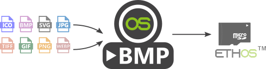
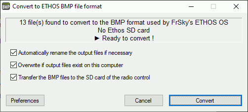

#

# Convert_to_ETHOS_Bmp.exe

### A simple utility to convert and use your images on the FrSky ETHOS OS in 2 clicks

If you are struggling :
 - to find the right image format,
 - to find the right naming rules,
 - to transfer images to the right location on the SD card,   
 
then this utility is for you !

- [Requirements for using this program](#ERequirements)
- [Quick start guide](#EQuickStart)

>**You wish to support this initiative by making a donation,  
>you can do so by clicking on the following link :** 

--------------------------------------------------

## Getting into the details
- [FrSky and ETHOS trademark](#ETrademark)
- [What is the license of this program ?](#ELicence)
- [What are the specifications of the Ethos BMP format ?](#EEthosBmpFormat)
- [What are the naming rules for the Ethos image file ?s](#ENamingRules)
- [How does the program find the Ethos SD card ?](#EFindSD)
- [How does this utility manage its preferences ?](#EPref)
- [What tools was this program developed with ?](#EDevelop)

--------------------------------------------------

###  Requirements for using this program
- Have a PC running Windows 8 or Windows 10
- Download and install the  **ImageMagick** program (on this webpage : **[https://imagemagick.com/](https://imagemagick.com/)**)
- Download the  **Convert_to_ETHOS_Bmp.exe** utility (**[download link](https://github.com/Ceeb182/ConvertToETHOSBMPformat/raw/master/Binary/Convert_to_ETHOS_bmp.exe)**)

Note : ImageMagick is a free software program delivered as a ready-to-use binary distribution that allows you to perform image manipulation from the command line. Don't worry, the "**Convert_to_ETHOS_Bmp.exe**" utility will automatically drive the ImageMagick converter !

###  Quick start guide
- Put your images in a directory
- Put the utility  **Convert_to_ETHOS_Bmp.exe** in the same directory
- Launch by double-clicking on   **Convert_to_ETHOS_Bmp.exe** 
- Click on the "**Convert**" button
- That's all!  

The result is :
- in the "*FrSkyEthosBMP*" directory of the current directory
- automatically transferred to your ETHOS SD Card (if the SD card has been detected and the transfer option is checked)

 

###  FrSky and ETHOS trademark
- This is not a FrSky website.  
FrSky is not responsible for the use of this utility.
- FrSky is a registered trademark whose official site is https://www.frsky-rc.com/ .    
FrSky is a company that designs and manufactures high-performance equipment in the field of radio control and its accessories.
- Ethos is the name of the operating system powering the Horus and Tandem series radio controls (such as the X10 Express, X12 ISRM, X20...). Ethos is developed by the FrSky team.  
For more information go to : https://ethos.frsky-rc.com/

###  What is the license of this program ?
This program is free software; you can redistribute it and/or modify it under the terms of the GNU General Public License version 2 as published by the Free Software Foundation.

This program is distributed in the hope that it will be useful but WITHOUT ANY WARRANTY; without even the implied warranty of MERCHANTABILITY or FITNESS FOR A PARTICULAR PURPOSE. See the GNU General Public License for more details : http://www.gnu.org/licenses/gpl-2.0.html

###  What are the specifications of the Ethos BMP format ?
From version 1.0.10 of Ethos, the recommended image format is the following BMP format:
- 32bits BMP format 
- 8 bits per colour  
- Alpha channel (used for image transparency)  
- Size : 300x280px  

>####  Note :
> This format reduces the computational load on the on-board microcontroller of the radio control.

###  What are the naming rules for the Ethos image file ?
To comply with ETHOS naming rules (Ethos version 1.0.14) :
- Rule 1 : use only the following characters : A►Z, a►z, 0►9, ()!-_@#;[]+= `Space`
- Rule 2 : at least one of the following characters must be present in the name : a►z or ;[]+=`Space`
- Rule 3 : the name must not contain more than 11 characters

>####  Notes :
>- In addition to these 3 rules, the utility replaces all accented vowels by their equivalent without accent in order not to modify the original meaning of the name given by the user.
>- If the name is longer than 11 characters, it is displayed in the SD card explorer but does not appear in the model image selection interface.

###  How does the program find the Ethos SD card ?
The utility searches all removable drives.  
It then looks for the following tree structure:  
- `\audio\en` (as directory)
- `\audio\fr` (directory)
- `\bitmaps\user` (directory)

The search stops on the first removable drive matching these criteria.

>####  Note :
>If the Ethos SD card is not found, then the button only displays "**Convert**".  
>If the Ethos SD card has been found and the transfer option is checked, then the button displays only "**Convert and transfer**".  
>You can search for the SD card again by double-clicking on the information area of the utility.  

###  How does this utility manage its preferences ?
The utility preferences are saved in an INI file with the same name and location as the utility.   
If the preferences are default, the utility does not generate an INI file and deletes the INI file if it exists.  

###  What tools was this program developed with ?
The  **Convert_to_ETHOS_Bmp.exe** utility was developed with the **[AutoIt v3](https://www.autoitscript.com/site/)** scripting language.  
The icon of the utility was made with **[Inkscape](https://inkscape.org/)** and **[IcoFx 1.6.4](https://portableapps.com/apps/graphics_pictures/icofx_portable)**.  
The media was made with **[Gimp](https://www.gimp.org/)**.  
  
---------------------------------------------
*Author : Ceeb182@laposte.net / 2021 / Source : github/ceeb182/ConvertToETHOSBMPformat/README.MD*